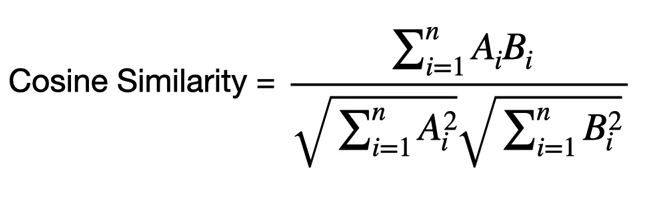

# Document_Similarity_Matching
 Document Similarity Matching Assignment for Fullstack SWE Intern 2024
 
 <b>Text Extraction:</b>
 
The PDF are read through the PyPDF2 library and are converted into a String. The String is next converted to a List with all the words.
 
 
 <b>Similarity Metric - Cosine Similarity:</b>
 
By finding the repeated words from the two PDFs using a Hashmap we can calculate the Cosine Similarity using the formula given below,
 
  
 <b>Example:</b> 
 
Consider the Table below

 
 
Here the Cosine Similarity can be Calculated by knowing the Repeated Words

  
 <b>Approach:</b>
 
To find the Cosine Similarity, I first converted the PDFs to Strings, then the Strings into Lists. Now the counts of each words can be calculated easily using a Hashmaps. Then iterating through all the Keys in the Hashmap we can calculate the Numerator. Similarily the Denominator is also calculated. Therefore the Cosine Similarity is calculated as Numerator/Denominator.
 
 <b>Classification: </b> 
 
To find the similarity, the Cosine Similarity of test PDF to all the PDFs in the Train Directory is computed and the PDF having the largest Cosine Similarity is the most similar to test PDF. Note: In some cases the PDFs don't match and result in a low Similatrity value. So if the Similarity Value is less than 0.2 then the program assumes that there is no match

